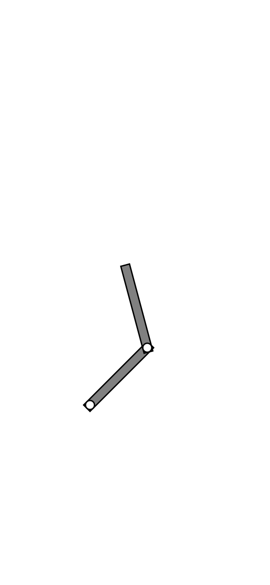

# Scara Robot
The aim of the project is to create a .cpp program which generate an SVG drawing of a SCARA Robot as shown in this figure:


# Getting Started
To run the code on your local machine just clone this repository.

### Prerequisites

To run this program you need to install CMAke tools

# Guide to the program
## <a name="param"></a> Parameters
* thickness: is the width of the robotic arms; these will have equal thickness.
* length: is the length of the arms, both arms will have equal length.
* radius: is the radius for both revolute joints
* q1: is the angle of the first arm of the robot measured from the x axis
* q2: is the angle of the second arm of the robot measured from the first arm of the robot
* (x,y): are the coordinates of the centre of the first revolute joint. these coordinates are referred to the top left corner of the svg file.

### Constraints
The device must satisfy these constraints:
    *  all dimension *must* be  strictly positive values
    *  the radius of revolute joints must be less than or equal to a half of the thickness of the arms.
    *  arms have the same width
    *  arms of different lengths are *not* allowed
    *  the angle of the second arm must be different from 0 with respect to the first arm
## Device building functions 
### `fc_scara_init`

````
fc_scara* fc_scara_init( int thickness, int length,  int radius, int q1, int q2, int x, int y);
````
this function takes as input all the parameters which define the robot, if these don't follow given constraints the function will return a `NULL` pointer.

### `fc_set_` functions
````
int fc_set_thickness();
int fc_set_length();
int fc_set_radius();
int fc_set_q1();
int fc_set_q2();
int fc_set_frame();
````
these functions can be used to modify parameters according to constraints.

### `fc_delete_robot()`
this function deletes the memory allocated in the heap by the `init` function. 

## File handling functions
### `fc_scara_to_svg()`
this function converts a structure into an svg representation of the same.
### `fc_svg_to_scara`
This function read an svg file to extract data for a new structure.
The function works if the svg follow a 'special' syntax.

### `fc_load_from_file`
Use this function to load a structure from an existing file
### `fc_scara_save`
Use this function to save a structure to newfile or to overwrite an existing file.
The function want ask for confirmation before overwriting.
## Commandline program
the `main.cpp`file contains a basic command line program which allows the user to create, load and save an svg file.
This functin will explicitly ask the user the values of the parameters given in the [parameters list above](#param)

## Running the tests
here write how to run tests and explain what these tests test and why

## Built With

* [CMake](https://cmake.org) 

## Contributing
When contributing to this repository, please first discuss the change you wish to make via issue, email, or any other method with the owners of this repository before making a change.


## Versioning

It has been used [SemVer](http://semver.org/) for versioning. For the versions available.

## Authors

* **Federico Corso** - [FedericoCorso](https://github.com/FedericoCorso)

See also the list of [contributors] who participated in this project. (to update)


## Acknowledgments
(to update)


